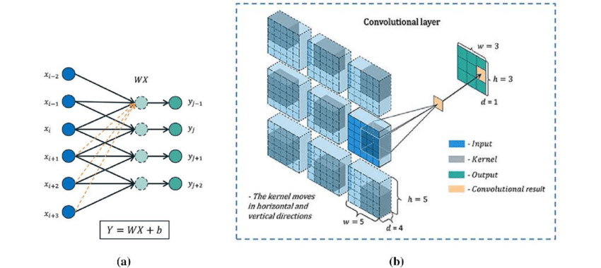
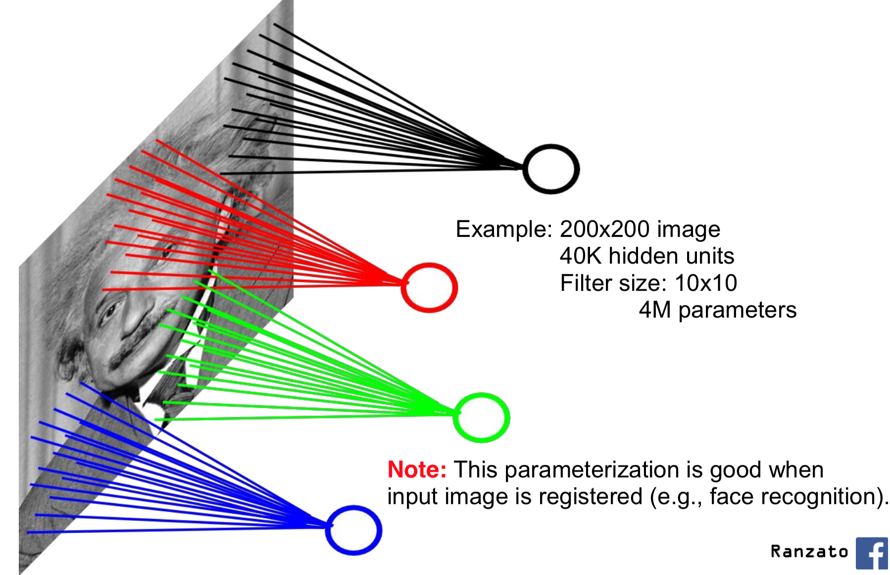

# Convolutional Layer and RGB - Deep Learning with PyTorch 12

## Fully Connected Vs Locally Connected

  
url: <https://media.geeksforgeeks.org/wp-content/cdn-uploads/20230602113310/Neural-Networks-Architecture.png>  
from article: *<https://www.geeksforgeeks.org/artificial-neural-networks-and-its-applications/>*

Convutional neural network:

*<https://www.researchgate.net/profile/Qi_Gao10/publication/331958875/figure/download/fig1/AS:739433636708352@1553306125177/A-simple-sketch-of-the-convolutional-layer-a-Local-connectivity-between-input-and.png>*

## Can Have Many Filter Layers

## Three Dimensional RGB Images

## Red, Green, Blue

## Fully Connected Last Stage

*<https://www.cs.toronto.edu/~lczhang/360/lec/w04/imgs/local.png>*

## Conclusion
